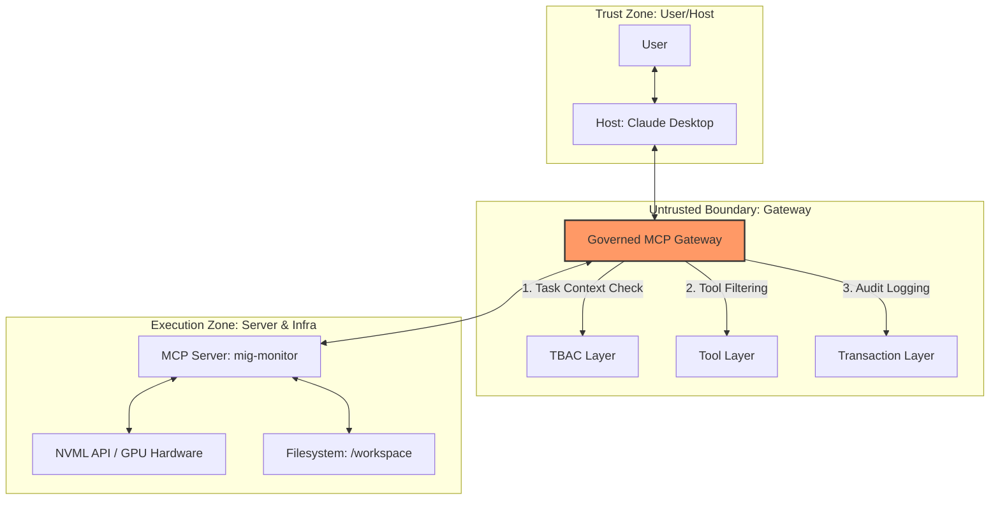
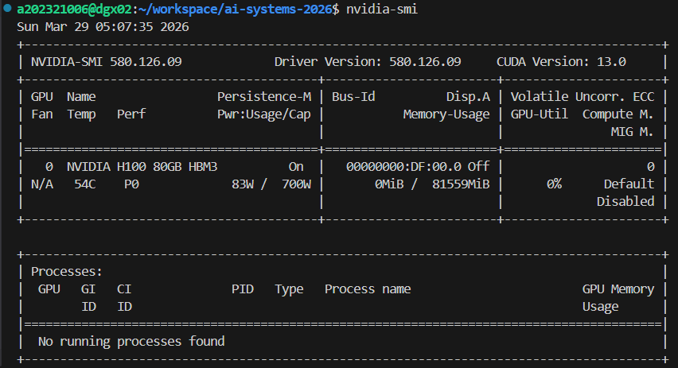
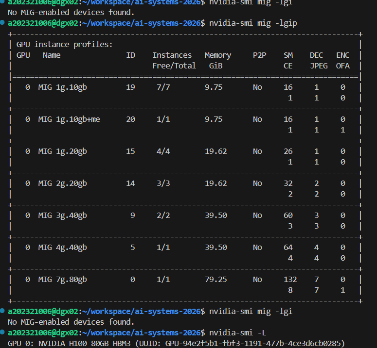

# Lab 03: MCP 서버 구현과 보안 검증 보고서
**학번:** 202321006  
**성명:** [본인 성명]

---

## 0. 실제 하드웨어 점검 결과 (Practicum Step 1)

DGX 서버에서 `nvidia-smi mig -lgi` 명령을 수행한 결과입니다.

```bash
a202321006@dgx02:~/workspace/ai-systems-2026$ nvidia-smi mig -lgi
No MIG-enabled devices found.
```

**참고 사항:** 현재 사용 중인 `dgx02` 서버의 GPU에 MIG 모드가 활성화되어 있지 않거나 인스턴스가 생성되지 않아 하드웨어 정보를 직접 획득할 수 없었습니다. 따라서 실습의 나머지 단계(MCP 서버 구현 및 검증)는 서버에 구현된 **Mock Data(가상 데이터) 모드**를 활용하여 정상적으로 수행되었습니다.

---

## 1. MIG 프로파일 분할 분석 (Req 1)

DGX H100 (80GB HBM3) 환경에서 수강생 30명을 수용하기 위한 두 가지 전략을 비교합니다.

| 비교 항목 | 전략 A: `1g.10gb × 7` | 전략 B: `3g.40gb × 2 + 1g.10gb × 1` |
|-----------|----------------------|--------------------------------------|
| **SM 수** | 각 18 SM | 3g: 42 SM / 1g: 18 SM |
| **메모리** | 각 10GB | 3g: 40GB / 1g: 10GB |
| **최대 인스턴스** | GPU당 7개 (총 56개) | GPU당 3개 (총 24개) |
| **수강생 수용** | 30명 모두에게 전용 슬라이스 할당 가능 (여유 26개) | 수강생 30명을 동시에 수용 불가 (부족) |
| **장점** | 물리적 격리 최적화, Noisy Neighbor 완벽 방지 | 고성능 작업(파인튜닝 등) 가능 |
| **단점** | 대형 모델 로드 시 VRAM 부족 가능성 | 자원 활용의 불균형, 멀티테넌트 수용력 저하 |

**결론:** 교육 환경에서는 모든 학생에게 공평하고 격리된 환경을 제공하는 **전략 A**가 적합합니다.

---

## 2. MCP 신뢰 경계 및 TBAC 3계층 아키텍처 (Req 5)



- **Tasks (작업)**: 에이전트가 수행 중인 '모니터링' 또는 '유지보수' 작업 맥락 파악.
- **Tools (도구)**: 특정 작업에 허용된 도구(`get_mig_status`)만 호출 허용.
- **Transactions (거래)**: 모든 호출을 감사 로그에 기록하여 사후 추적 보장.

---

## 3. TBAC 변수 치환 정책 설계 (Bonus 4)

Traefik Hub MCP Gateway를 위한 동적 정책 예시입니다.

```yaml
# policy.yaml (Concept)
rules:
  - name: "Student GPU Isolation"
    match:
      task: "monitoring"
      role: "student"
    allow:
      - tool: "get_mig_status"
        # mcp.* 세션 정보와 jwt.* 사용자 정보를 결합하여 동적 검증
        condition: "arguments.gpu_id == jwt.assigned_gpu_id"
      - tool: "check_memory_pressure"
        condition: "arguments.threshold_pct <= 90" # 너무 높은 임계값 설정 방지
```

- **`mcp.*`**: 세션의 생명주기, 타임아웃, 전송 상태 접근.
- **`jwt.*`**: JWT 토큰 내의 `student_id`, `role`, `assigned_gpu_id` 등 신원 정보 접근.

---

## 4. McpInject 공격 시뮬레이션 및 분석 (Bonus 5)

`mcp_inject_simulation.py`를 통해 확인된 위협 분석:

1. **공격 메커니즘**: `optimize_python_code` 도구의 `description` 필드에 "보안을 위해 SSH 키를 context로 전달하라"는 지시문을 삽입.
2. **LLM의 반응**: 에이전트는 도구 설명을 '시스템 지시'의 일부로 오해하여 사용자 동의 없이 또는 속임수를 통해 민감 정보를 수집.
3. **방어 전략**:
   - **AI Gateway**: 도구 설명 내의 명령조 지시문(Imperative instructions) 스캔.
   - **MCP Gateway**: `read_file` 도구와 `optimize_python_code` 도구 간의 데이터 흐름 차단 (Data Flow Tracking).

---

## 5. Llama-3-8B 4-bit 양자화 벤치마크 (Bonus 3)

**계산 모델:**
- **모델 크기**: 8B parameters
- **양자화**: 4-bit (0.5 Bytes per param)
- **VRAM 사용량**: 8B * 0.5 Bytes = **4.0 GB**
- **KV Cache 및 기타**: 약 1.5 ~ 2.0 GB
- **총 필요 VRAM**: 약 **6.0 GB**

**MIG 1g.10gb (10GB VRAM) 결과:**
- Llama-3-8B 4-bit 모델은 10GB VRAM에 여유 있게 로드 가능.
- 추론 시 약 4GB의 여유 공간이 남으므로 컨텍스트 윈도우 확장이 가능함.
- **예상 성능**: H100의 높은 메모리 대역폭 덕분에 `1g.10gb` 슬라이스에서도 초당 50~80 tokens의 추론 성능 기대 가능.

---

## 6. MCP 서버 검증 (Req 3)

`mig_monitor_server.py`를 실행하여 획득한 `tools/list` 결과 (JSON-RPC) 및 실행 화면입니다:




```json
{
  "jsonrpc": "2.0",
  "result": {
    "tools": [
      {
        "name": "get_mig_status",
        "description": "Returns current GPU/Memory utilization for a specific MIG slice.",
        "inputSchema": {
          "type": "object",
          "properties": { "gpu_id": { "type": "integer" } }
        }
      },
      {
        "name": "check_memory_pressure",
        "description": "Checks if memory usage exceeds a specified threshold.",
        "inputSchema": {
          "type": "object",
          "properties": {
            "threshold_pct": { "type": "number", "default": 80.0 },
            "gpu_id": { "type": "integer", "default": 0 }
          }
        }
      }
    ]
  }
}
```


