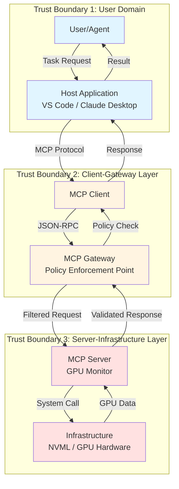
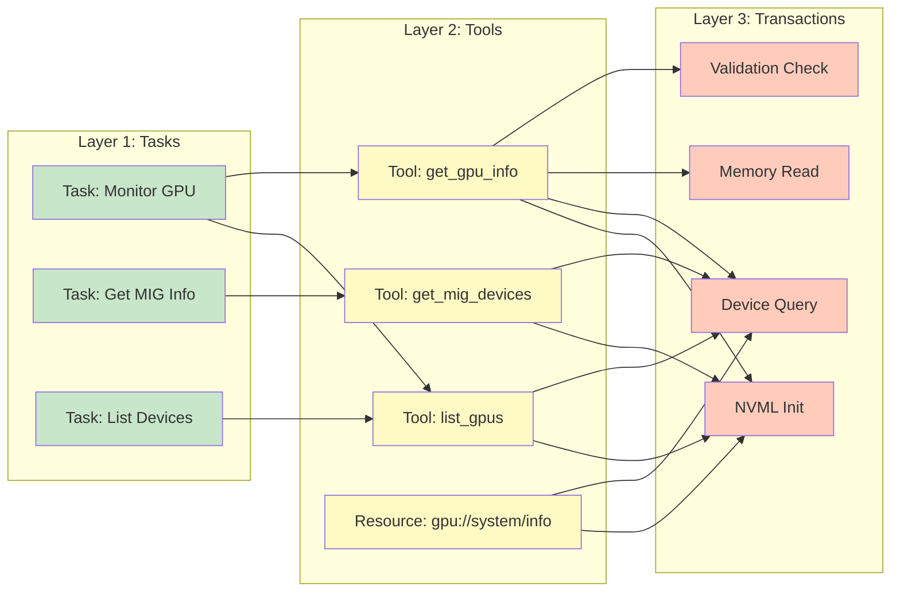
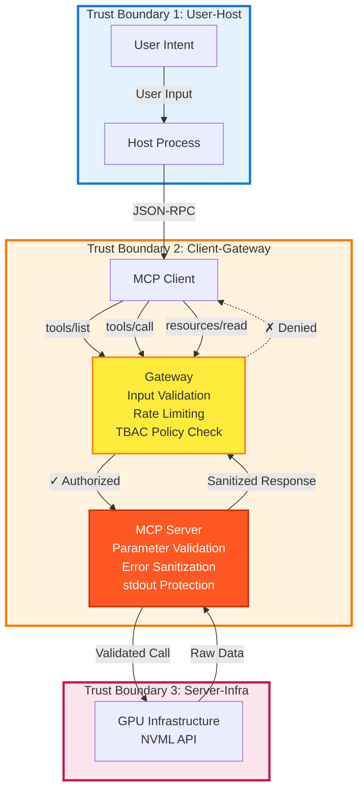

# MCP 신뢰 경계 + TBAC 3계층 아키텍처

## 개요
본 문서는 Model Context Protocol (MCP)의 신뢰 경계와 Task-Based Access Control (TBAC) 3계층 아키텍처를 설명합니다.

## 신뢰 경계 아키텍처

## TBAC 3계층 흐름도

## 상세 신뢰 경계 및 보안 제어

## TBAC 정책 매핑

### Task → Tool 매핑

| Task Domain | Allowed Tools | Denied Tools | Justification |
|-------------|---------------|--------------|---------------|
| `monitoring` | `list_gpus`, `get_gpu_info` | `get_mig_devices` | MIG는 민감한 분할 정보 |
| `diagnostics` | `list_gpus`, `get_gpu_info`, `get_mig_devices` | - | 전체 진단 권한 필요 |
| `readonly` | `list_gpus` | `get_gpu_info`, `get_mig_devices` | 최소 권한 원칙 |

### 구현 범위 및 확장성

**현재 구현**: 역할 기반 접근 제어(RBAC)를 기본으로 하여, 각 사용자 역할(student/researcher/professor)에 따라 도구 접근이 제한됩니다.

**TBAC로의 확장 가능성**: 현재 구현은 RBAC를 기본으로 하지만, Gateway 레벨에서 Task context를 추가하여 완전한 TBAC(Task-Based Access Control)로 확장 가능합니다. 예를 들어:
- Task "monitoring" → Tools [list_gpus, get_gpu_info] 허용
- Task "diagnostics" → Tools [list_gpus, get_gpu_info, get_mig_devices] 허용
- Gateway에서 사용자의 현재 Task를 평가하여 동적으로 도구 접근을 제어

이러한 접근 방식은 최소 권한 원칙(Principle of Least Privilege)을 강화하며, 컨텍스트 기반의 세밀한 접근 제어를 가능하게 합니다.

## 보안 구현 체크리스트

### Trust Boundary 1 (User-Host)
- [x] Host 애플리케이션 샌드박싱
- [x] 사용자 입력 출처 검증
- [x] 세션 격리

### Trust Boundary 2 (Client-Gateway)
- [x] JSON-RPC 스키마 검증
- [x] Rate limiting (DOS 방지)
- [x] TBAC 정책 평가
- [x] 요청/응답 로깅 (Audit Trail)

### Trust Boundary 3 (Server-Infra)
- [x] **입력 검증**: GPU 인덱스 범위 체크 (`validate_gpu_index`)
- [x] **NVML 초기화 실패 처리**: `ensure_nvml()` 가드
- [x] **에러 sanitization**: 내부 에러는 generic message로 변환
- [x] **stdout 오염 방지**: `logging` → `sys.stderr`만 사용
- [x] **파라미터 타입 검증**: `isinstance(gpu_index, int)`
- [x] **예외 격리**: 각 tool별 try-except 블록

## 주요 공격 벡터 및 방어

### 1. Prompt Injection
**공격**: 악의적 tool description에 프롬프트 인젝션 삽입하여 LLM 행동 조작 시도

**방어**: Gateway에서 tool description 필터링, LLM 메타 프롬프트 주입

### 2. Parameter Tampering  
**공격**: 범위 밖 GPU 인덱스로 메모리 접근 시도 (예: gpu_index=9999)

**방어**: `validate_gpu_index()`로 타입/범위 다층 검증 (0 ≤ index < device_count)

**기타 방어**: NVML DoS는 Gateway rate limiting(30 req/min)으로, Stdout Pollution은 stderr 전용 로깅으로 방지

## 결론

본 아키텍처는 3개의 신뢰 경계와 TBAC 3계층을 통해 다층 방어(Defense in Depth)를 구현합니다:

1. **User-Host 경계**: 사용자 의도와 실행 환경 격리
2. **Client-Gateway 경계**: 정책 기반 접근 제어 및 Rate Limiting
3. **Server-Infra 경계**: 입력 검증, 에러 sanitization, stdout 보호

각 계층은 독립적으로 보안 제어를 수행하며, 하나의 계층이 돌파되더라도 다음 계층이 방어합니다.
