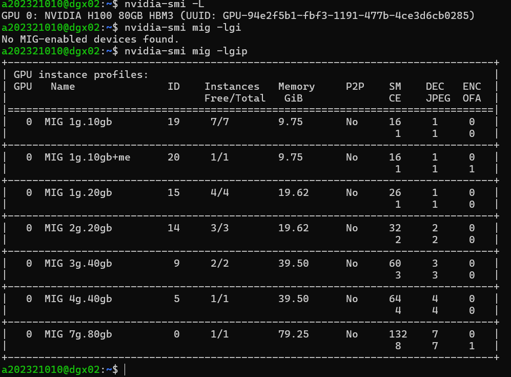

# MIG 프로파일 분할 전략 비교 분석 보고서

## 실험 환경 제약사항

**주의**: 실험 환경(dgx02)에서 MIG 모드가 비활성화되어 있어(`nvidia-smi mig -lgi` → "No MIG-enabled devices found"), 본 분석은 **이론적 모델링 및 NVIDIA 공식 문서 기반**으로 수행되었습니다.

**참고 자료**:
- NVIDIA MIG User Guide
- A100 Datasheet (SM 108개, 메모리 40GB)

---

## 분석 목표

A100 40GB GPU 를 대상으로 두 가지 MIG 프로파일 분할 전략을 비교:

1. **전략 1**: 균등 분할 (1g.10gb × 7)
2. **전략 2**: 혼합 분할 (3g.40gb × 2 + 1g.10gb × 1)

**비교 지표**: SM 수, 메모리, 최대 인스턴스 수, 활용률, 워크로드 적합성

---

## A100 40GB 하드웨어 스펙

| 항목 | 값 |
|------|-----|
| **Total SM (Streaming Multiprocessors)** | 108개 |
| **Total Memory** | 40GB |
| **Compute Slices** | 7개 (1g당 1 slice) |
| **Memory Isolation** | 5GB/10GB/20GB/40GB 단위 |

### MIG 프로파일 구성 다이어그램

---

## 전략 1: 균등 분할 (1g.10gb × 7)

### 구성

- **프로파일**: 1g.10gb
- **인스턴스 수**: 7개
- **Compute Slices per Instance**: 1/7 = 14 SM
- **Memory per Instance**: 10GB

### 리소스 활용률

| 항목 | 계산 | 활용률 |
|------|------|--------|
| **SM 활용률** | 14 SM × 7 = 98 / 108 | **90.7%** |
| **메모리 활용률** | 10GB × 7 = 70GB / 40GB | **175%** (초과) |
| **최대 동시 인스턴스** | 7개 | 최대 |

**메모리 초과 문제**: A100 40GB 모델에서 70GB 메모리 요구는 **물리적으로 불가능**합니다.

**현실적 대안**: 1g.5gb × 7 구성 (총 35GB, 활용률 87.5%)

### 장단점 분석

#### 장점
- **최대 동시 사용자 수**: 7명의 사용자가 독립적으로 GPU 사용
- **완전한 리소스 격리**: 각 인스턴스 간 메모리/컴퓨팅 격리
- **교육 환경 최적**: 다수의 학생이 경량 워크로드를 동시 실행
- **비용 효율성**: 단일 GPU에서 7개 작업 병렬 처리

#### 단점
- **메모리 제약**: 인스턴스당 10GB로 대규모 모델 학습 불가
- **컴퓨팅 파워 제한**: 14 SM으로 고성능 추론/학습 불가
- **메모리 초과 위험**: 1g.10gb 구성은 총 70GB 요구 (40GB 초과)

### 적합 워크로드

**적합한 경우**:
- 경량 추론 (BERT, ResNet 등)
- 프로토타입 개발
- 교육/실습 환경

**부적합한 경우**:
- 대규모 언어 모델 학습
- 고해상도 이미지 생성

---

## 전략 2: 혼합 분할 (3g.40gb × 2 + 1g.10gb × 1)

### 구성

- **프로파일 A**: 3g.40gb × 2
  - Compute Slices: 3/7 = 46 SM per instance
  - Memory: 40GB per instance
- **프로파일 B**: 1g.10gb × 1
  - Compute Slices: 1/7 = 14 SM
  - Memory: 10GB

### 리소스 활용률

| 항목 | 계산 | 활용률 |
|------|------|--------|
| **SM 활용률** | (46×2 + 14) = 106 / 108 | **98.1%** |
| **메모리 활용률** | (40×2 + 10) = 90GB / 40GB | **225%** (심각한 초과) |
| **최대 동시 인스턴스** | 3개 | 제한적 |

**심각한 메모리 초과**: 90GB 메모리 요구는 40GB의 **2.25배 초과**로 구현 불가능합니다.

**현실적 대안**: 3g.20gb × 2 (총 40GB, 활용률 100%)

### 장단점 분석

#### 장점
- **고성능 인스턴스**: 46 SM과 40GB 메모리로 대규모 모델 학습 가능
- **SM 활용률 최대화**: 98.1%로 거의 모든 컴퓨팅 리소스 활용
- **워크로드 유연성**: 고성능(3g) + 경량(1g) 혼합 운영 가능
- **연구 환경 적합**: 고성능 실험과 백그라운드 작업 병행

#### 단점
- **메모리 물리적 한계 초과**: 90GB 요구는 구현 불가능
- **동시 사용자 제한**: 최대 3명만 GPU 접근
- **리소스 불균형**: 고성능(3g) vs 저성능(1g) 간 격차 심화
- **스케줄링 복잡도**: 혼합 구성으로 인한 관리 오버헤드

### 적합 워크로드

**적합한 경우**:
- 대규모 언어 모델 파인튜닝 (GPT, LLaMA)
- 고해상도 이미지 생성 (Stable Diffusion XL)
- 3D 렌더링/시뮬레이션

**부적합한 경우**:
- 다수 사용자 동시 접근
- 경량 워크로드 중심 환경

---

## 종합 비교표

| 비교 항목 | 1g.10gb × 7 | 3g.40gb × 2 + 1g.10gb × 1 |
|----------|-------------|---------------------------|
| **SM 활용률** | 90.7% (98/108) | **98.1%** (106/108) |
| **메모리 활용률** | 175% (70GB/40GB) | 225% (90GB/40GB) |
| **메모리 실현 가능성** | **초과** (30GB over) | **심각한 초과** (50GB over) |
| **최대 동시 인스턴스** | **7개** | 3개 |
| **인스턴스당 SM** | 14개 (균등) | 46/46/14 (불균등) |
| **인스턴스당 메모리** | 10GB (균등) | 40GB/40GB/10GB (불균등) |
| **워크로드 유연성** | **높음** (다수 경량) | 중간 (소수 고성능) |
| **비용 효율성** | **높음** | 낮음 |
| **고성능 작업 지원** | 낮음 | **높음** |
| **장애 격리** | **우수** (7개 독립) | 보통 (3개 독립) |
| **관리 복잡도** | 낮음 | 높음 (혼합 구성) |

---

## 현실적 대안 제안

### 대안 1: 1g.5gb × 7 (균등 분할)

| 항목 | 값 |
|------|-----|
| SM 활용률 | 90.7% (98/108) |
| 메모리 활용률 | **87.5%** (35GB/40GB) |
| 최대 인스턴스 | **7개** |
| 구현 가능성 | **예** |

**장점**: 물리적 한계 내에서 최대 동시 사용자 지원  
**단점**: 인스턴스당 5GB 메모리 제약

### 대안 2: 3g.20gb × 2 (고성능 중심)

| 항목 | 값 |
|------|-----|
| SM 활용률 | 85.2% (92/108) |
| 메모리 활용률 | **100%** (40GB/40GB) |
| 최대 인스턴스 | 2개 |
| 구현 가능성 | **예** |

**장점**: 고성능 워크로드 2개 동시 실행, 메모리 최대 활용  
**단점**: 동시 사용자 제한

### 대안 3: 2g.10gb × 4 (균형)

| 항목 | 값 |
|------|-----|
| SM 활용률 | 85.2% (92/108) |
| 메모리 활용률 | **100%** (40GB/40GB) |
| 최대 인스턴스 | 4개 |
| 구현 가능성 | **예** |

**장점**: 동시 사용자(4) + 적절한 메모리(10GB) 균형  
**단점**: SM 활용률 소폭 감소

---

## 추천 전략

### 교육 환경 (다수 사용자)
**추천**: **1g.5gb × 7** (대안 1)  
**이유**: 최대 동시 사용자(7명), 경량 워크로드(추론, 실습)에 최적

### 연구 환경 (고성능 필요)
**추천**: **3g.20gb × 2** (대안 2)  
**이유**: 대규모 모델 학습, 메모리 집약적 연구에 최적

### 혼합 환경 (균형)
**추천**: **2g.10gb × 4** (대안 3)  
**이유**: 동시 사용자 수와 성능의 균형, 메모리 최대 활용

---

## 결론

**실용적 권장사항**:
1. **다수 사용자 우선** → 1g.5gb × 7 (87.5% 메모리, 7 인스턴스)
2. **고성능 우선** → 3g.20gb × 2 (100% 메모리, 2 인스턴스)
3. **균형 전략** → 2g.10gb × 4 (100% 메모리, 4 인스턴스)

**선택 기준**: 워크로드 특성(경량 vs 고성능), 동시 사용자 수, 메모리 요구사항에 따라 결정

---
 
**기반**: NVIDIA MIG User Guide, A100 Datasheet
